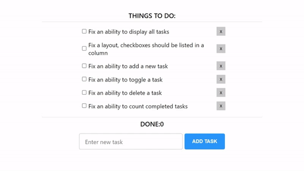

# React TO DO application

As you can see, it’s a simple ReactJS to-do application. 
But a candidate will receive a broken version.

This application was intentionally broken, there are six critical issues that a candidate has to fix:

1. Fix an ability to display all tasks.
2. Fix a layout, checkboxes should be listed in a column.
3. Fix an ability to add a new task.
4. Fix an ability to toggle a task.
5. Fix an ability to delete a task.
6. Fix an ability to count completed tasks.

There are several criteria to pass a coding part successfully:

1. A candidate should be able to understand code structure and navigate through it;
2. A candidate should determine why code is broken and what steps are needed to perform to fix an application;
3. A candidate has to talk about steps is about to perform; it’s a really good practice. It helps me determine if a candidate goes in the right way and hint if not. In addition, I assess communication skills;
4. A candidate should fix most of the critical issues in the application. The current coding task aims to assess the understanding of working with React and experience in Javascript. Unfortunately, if a person won’t resolve most of the issues, it’s a red flag;

## What We Expect;
1. Push your working project on a new branch on the same GitHub repo.
2. write a good commit message describing the changes you made.
3. Project builds correctly without errors and runs.
3. write about the performed step. 

## Available Scripts

Use `npm start` to run project.